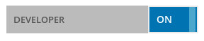

# Installing The SiteChef CLI

1. Install [Node.js](nodejs.org/download)
2. Install the SiteChef command line utility `npm install sitechef -g`
3. Clone your theme to a local directory
  `sitechef init [your-api-key] [optional directory name]`
  eg: `sitechef init 999999999888888`
  (see [below](#generate-an-api-key-for-a-theme) for more info)
4. Move to your directory (`cd [your-directory]`) and run the local server `sitechef serve`

# Generate an API key for a theme

1. Sign in to the [SiteChef Admin area](https://admin.sitechef.co.uk)
2. Go to the "Your Account" section
3. Turn on "Developer Mode":
  
4. Go to "Theme Manager" and click "Edit/Clone Existing"
5. Select one of the existing themes and choose "New From This"
  
6. Create a new name and description for this theme.
   "Clonable" means that this theme can be cloned by other developers
   "Private" means that this theme will only be made available to the current site
