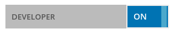

# Installing The SiteChef CLI


1. install [node.js](nodejs.org/download)
2. install [yarn 1.x](https://classic.yarnpkg.com/en/docs/install)
3. install [nvm](https://github.com/nvm-sh/nvm/blob/master/readme.md#installing-and-updating)
4. set the node version to `8.2.1` - this is a requirement until we are able to successfully upgrade the `sitechef-cli`
5. install the sitechef command line utility `yarn global add sitechef`
6. clone your theme to a local directory
  `sitechef init [your-api-key] [optional directory name]`
  eg: `sitechef init 999999999888888`

# Setting up an existing theme

If you have cloned a theme from github and the `package.json` does not
already have a script for installing it you should run

```
sitechef setup <your api key>
```

# Generate an API key for a theme

1. Sign in to the [SiteChef Admin area](https://admin.sitechef.co.uk)
2. Go to the "Your Account" section
3. Turn on "Developer Mode":
  
4. Go to "Theme Manager" and click "Edit/Clone Existing"
5. Select one of the existing themes and choose "New From This"
  
6. Create a new name and description for this theme.
   "Clonable" means that this theme can be cloned by other developers
   "Private" means that this theme will only be made available to the current site
